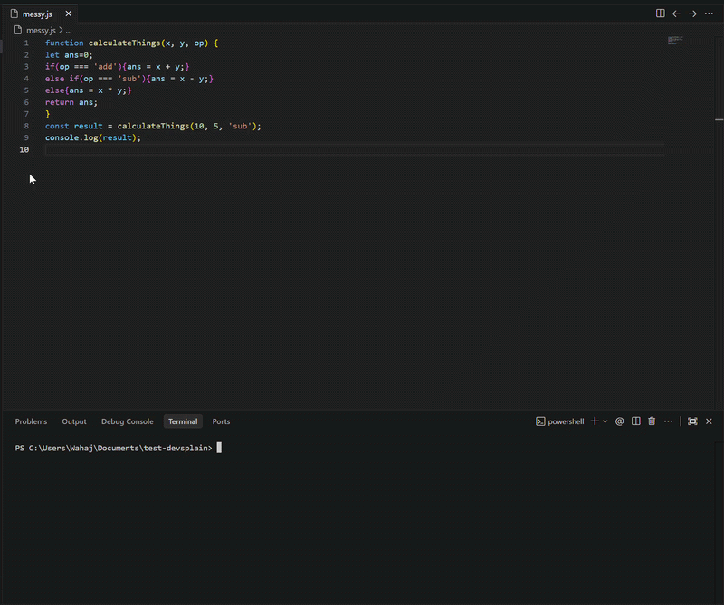

# devsplain
An agent-agnostic CLI tool that adds JSDoc and inline comments using state-of-the-art LLMs while preserving non-comment source lines byte-for-byte through deterministic verification.



devsplain never rewrites executable code.
If the original source cannot be reproduced exactly after comment insertion, the operation aborts.
---

## Key Features

- **Deterministic Code Integrity Verification**: Uses an index-preserving splicing engine. Your non-comment source lines are guaranteed to remain byte-for-byte identical after comment insertion.
- **Multi-Language support**: Natively parses JavaScript, JSX, TypeScript, TSX, HTML, CSS, SCSS, Vue, Svelte, Python, Java, C, C++, C#, Go, Ruby, PHP, Rust, Swift, Kotlin, Dart, and Shell scripts.
- **Comment Preservation & Tagging**: AI-generated comments are tagged with `[ds]`. Your manually written comments are safe and will never be touched by the engine.
- **Local Deterministic Scrubber**: The `--clean` flag strips AI-generated `[ds]` comments locally using a deterministic lexical state machine—no LLM calls, API keys, or internet required.
- **Git Hook Automation**: Supports an automated two-commit Git hook workflow (`pre-commit` for quality, `post-commit` for auto-generated documentation commits) that prevents recursive commit loops.
- **Bring Your Own LLM**: Native setup wizard for Groq, Gemini, OpenAI, or any OpenAI-compatible API endpoint (like Ollama or LMStudio).
- **Exponential Backoff**: Resilient AI request handler that automatically retries rate-limited requests with exponential backoff.
- **Headless & Override Control**: Configure via environment variables or override global config settings dynamically on the fly with command-line flags.

---

## Architecture & Safety Guarantees

Many AI code formatters rewrite your code entirely, exposing you to logic regressions and subtle syntax corruption. `devsplain` is designed from the ground up to prevent this.

### The Splicing Engine
1. The CLI prepends line numbers to your source code and sends it to the LLM.
2. The LLM returns a structured JSON payload containing target line numbers and comment contents:
   ```json
   [
     { "line": 12, "comment": "// Calculates the exponential backoff delay" }
   ]
   ```
3. The splicing engine inserts comments directly into the source array at the requested indices.
4. **Validation Check**: Before writing to disk, `devsplain` filters out the added comments and compares the remaining code lines against your original source. If a single line of executable code has changed, shifted, or been omitted, the process aborts immediately, safeguarding your code from corruption.

### String Literal Guardrails
The engine tracks lexical state across template strings, single quotes, double quotes, and multi-line docstrings (such as Python triple-quotes). Comment insertion is blocked if the target line resides within a string literal, preventing broken syntax.

### Why Not AST Verification?

AST verification would require language-specific parser dependencies for every supported language.

`devsplain` instead uses deterministic source-preservation verification:

1. Original source is loaded.
2. Comments are inserted.
3. Generated comments are removed.
4. The remaining source must match the original file exactly.

If any non-comment source line differs, the operation aborts.

---

## Installation

Install globally using `npm`:
```bash
npm install -g devsplain
```

Or run it on demand without installation:
```bash
npx devsplain <file-or-directory> [options]
```

---

## Setup & Configuration

On its first run, `devsplain` launches an interactive configuration wizard to configure your preferred LLM provider.

To force re-run the configuration wizard at any time, execute:
```bash
devsplain --config
```

Your settings are stored securely in `~/.devsplainrc` (configured with `chmod 600` on POSIX systems to restrict read access).

---

## CLI Usage & Options

```bash
devsplain <file-or-directory> [options]
```

### Options

| Flag | Description |
|---|---|
| *(Default)* | Balanced commenting. Generates a mix of JSDoc block comments above functions and sparse inline comments for complex logical branches. |
| `--light` | Minimalist commenting. Adds JSDoc/block comments above functions, leaving function bodies untouched. |
| `--full` | Aggressive commenting. Explains complex logic blocks line-by-line inside functions. |
| `--dry-run` | Preview comments in the terminal without writing to files. Prompts for manual save confirmation. |
| `--force` | Bypasses the safety block check that prevents running `devsplain` on a dirty Git working tree. |
| `--clean` | Scrubber mode. Deterministically removes only devsplain-generated comments tagged with `[ds]`, preserving your manual comments. |
| `--prune` | Destructive scrubber mode. Removes ALL comments and docstrings from source files, including your own manual comments. |
| `--provider <name>`| Temporary one-off override for the AI provider (`gemini`, `groq`, `openai`, `custom`) for this command run only (does not modify the saved config file). |
| `--model <name>` | Temporary one-off override for the model name for this command run only. |
| `--api-key <key>` | Temporary one-off override for the API key for this command run only. |
| `--base-url <url>` | Temporary one-off override for the API base URL for this command run only. |
| `--config` | Relaunches the configuration setup wizard. |
| `--setup-hook` | Installs Git pre-commit and post-commit hooks in the repository. |
| `--help, -h` | Displays the help menu. |
| `--version, -v` | Displays version information. |

### Usage Examples

```bash
# Light commenting on a single file
devsplain src/index.js --light

# Deep logic commenting on a folder (skips node_modules, .git, etc.)
devsplain src/ --full

# Clean and scrub AI-generated comments locally without API calls
devsplain lib/ --clean

# Destructively remove ALL comments (both AI and manual) from a folder
devsplain lib/ --prune

# Headless run using overriding credentials
devsplain src/utils.ts --provider gemini --model gemini-2.0-flash --api-key YOUR_KEY
```

> [!WARNING]
> **Directory Traversal Caution**
> The built-in list of ignored folders (like `node_modules`, `.git`, `dist`, etc.) is not exhaustive. If you run `devsplain` on a broad directory that contains unignored directories (such as local caches or build directories), it may start commenting unwanted files in random folders.
> 
> To prevent this, it is highly recommended to either:
> 1. Use the **Automated Git Hooks** to comment only on files modified in your commits.
> 2. Pass specific files or selective subfolders manually (e.g., `devsplain src/utils.ts`) instead of targeting broad directories.

---

## Environment Variables

For headless environments, CI pipelines, or automated scripts, `devsplain` respects the following environment variables:

- `DEVSPLAIN_PROVIDER`: Selects the AI provider (`groq`, `gemini`, `openai`, `custom`).
- `DEVSPLAIN_API_KEY`: The API key to use for the selected provider.
- `DEVSPLAIN_MODEL`: Specify a custom model.
- `DEVSPLAIN_BASE_URL`: Custom base endpoint for local/private API runs.

---

## Automated Git Hooks

Ensure all code changes in your repository are automatically documented by configuring Git hooks.

> [!NOTE]
> **Commit Duration Note**
> When the Git hooks are enabled, committing code may take a few seconds longer. This is because `devsplain` needs to call the AI provider, generate comments, and splice them into the modified files before completing the commit cycle.

### Installation
Run the hook setup command inside your Git repository:
```bash
devsplain --setup-hook
```

### Pipeline Architecture
1. **Pre-commit Hook**: Runs your project test suite (`npm test`). If the tests fail, the commit is blocked.
2. **Post-commit Hook**: 
   - Detects all modified files in the commit.
   - Runs `devsplain` to generate comments on the modified files.
   - Automatically stages and commits the comments in a secondary commit: `docs: auto-generated comments by devsplain`.
   - The secondary commit runs with `--no-verify` to prevent recursive hook invocation.
3. **Resilience**: If the API key is missing or the network is offline during the post-commit process, the script logs a warning to stderr and exits with status code `0`. Your initial commit remains safe and unblocked.

---

## License

This project is licensed under the MIT License.
